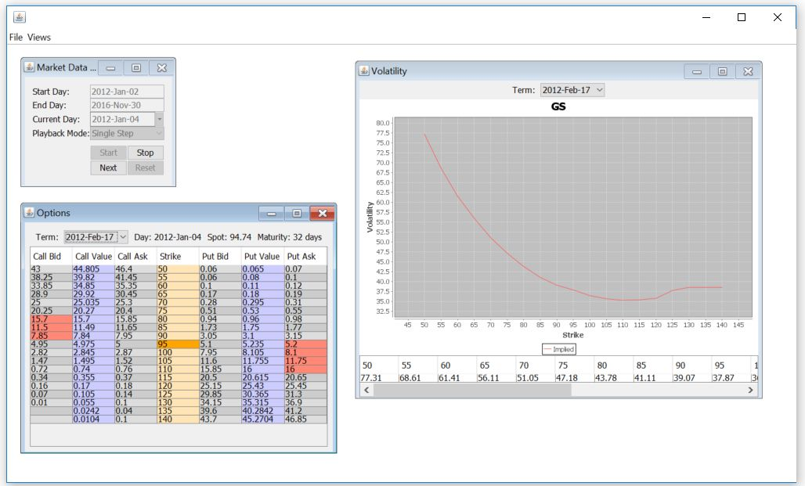

# AQuaRiAnS: Another Quantitative Risk Analysis Software
Quantitative finance software focused on options  
Website: [www.aquarianz.com](http://www.aquarianz.com/)  

# Development Environment Setup

Must have:

- [Git](https://git-scm.com/downloads) `sudo apt install git`
- [Java 8 SDK](https://www.oracle.com/java/technologies/javase/javase8-archive-downloads.html)
- [IntelliJ Idea Commnity Edition](https://www.jetbrains.com/idea/download/)
- [PostgreSQL](https://www.postgresql.org/download/) `sudo apt install postgresql`

Optional (assumes Linux):

- KWrite `sudo apt install kwrite`
- Krusader `sudo apt install krusader`
- [KDiff3](https://sourceforge.net/projects/kdiff3/files/latest/download)`sudo apt install kdiff3`

# Compile and run
git clone https://github.com/aquarians/Public.git  
cd Public/Aquarians  
mvn package  
mvn -pl Backtester exec:exec@Backtester  

# Picture of running app

